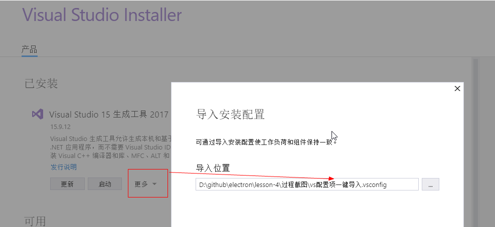

## electron调用c++动态库

## 目录结构

```
-lesson-4       项目目录
  - main        主进程目录
    - index.js
  - renderer    渲染进程目录
    - index.html
  - package.json
  - ... 其余不重要的略过
```

## 基础环境安装
理解以下demo，要求你具备一下能力

- node 基础包的简单使用
- npm 安装模块
- 能明确区分 开发依赖(devDependencies)和生产依赖(dependencies)
- electron基本API使用，能创建窗体，打开调试，会基本的调试
- 遇到问题会百度，不会的，请出门右转

<span style='color: red;'>start</span>
---

以下是从0开始弄的,不清楚，依次执行尝试即可


直接按照[node-gyp](https://github.com/nodejs/node-gyp#readme) 的官网安装

全局安装node-gyp
```js
 npm install -g node-gyp
```

在window机器上，使用option 1懒人一键安装
下面的命令，很慢，很慢，请确保你当前的网络是正常的，比较卡顿的，不用试了
下面的命令，一定使用管理员身份执行
```js
npm install --global --production windows-build-tools
```


它会安装基本的vs需要的包，然后会安装python 2.x的版本； 3.x是不支持的，我已经试过了，请不要费时间再试

安装完成，配置python环境变量
**控制面板>系统和安全>系统>高级系统设置>环境变量>系统变量>找到path**
添加python环境变量，我只要求你一点，粘贴复制路径，别TM用手敲路径，乱七八糟的错误，一概不要提问，出去面壁去


配置完成，在任意文件夹下面，试一下，环境变量配置是否生效


配置 微软的包版本
```js
npm config set msvs_version 2017
```
上面这个 2017 我没配置，没问题，如果需要配置，你可以配置，有的说 2017有问题，可以试一下 2015 如果没有报这种错误，就不管

打开npm 的配置文件

```js
npm config edit

python=C:\Users\Administrator\.windows-build-tools\python27\python.exe
ELECTRON_MIRROR=http://npm.taobao.org/mirrors/electron/
```


上面的那个npm配置的，也粘贴复制，你只有确保你的python路径是没问题的即可，别手敲路径，再一次强调

不管你是直接 npm config set 键值对 设置配置还是 npm config edit 编辑的  都是一样的效果，任选其一
配置项插入的位置，不用管，只要不是在注释中即可


window下面，我们上面安装的那个 windows-build-tools 工具，需要配置一些基础包
打开 Visual Studio Installer

在 过程截图  目录下面，有个配置包，你一键导入，免得找半天 **vs配置项一键导入.vsconfig**



安装就完事了，比较大，耐心点


**下面进入正题**

lesson 目录
```js
// 创建一个目录，比如 lesson
// 初始化package.json
npm init -y

// 安装基础的依赖包到 dependencies
npm install electron@4.2.9 --save
npm install ffi --save
npm install electron-rebuild --save

```

安装以后，我的package.json中是这样的
```js
{
  "name": "lesson-4",
  "version": "1.0.0",
  "main": "index.js",
  "license": "MIT",
  "scripts": {
    "start": "electron ./main/index.js"
  },
  "dependencies": {
    "electron": "4.2.9",
    "electron-rebuild": "^1.8.6",
    "ffi": "^2.3.0"
  },
  "devDependencies": {}
}
```
重新编译ffi

```js
cd node_modules & cd ffi
// 进入ffi目录
// 生成配置文件
node-gyp configure
// 重新编译
node-gyp build
```
编译以后，正常的情况是生成一下内容


编译过程有的人快，有的人慢，不要着急


以上基础包安装完毕，需要重新编译node_modules目录

```bash
cd node_modules
cd .bin/

electron-rebuild.cmd --module-dir ../../
```
重新编译过程有点慢，稍微等一下，如果失败了，会有提示信息，再重新执行一次即可

window环境下，如果你使用的是 CMD，请不要切换窗口，保证你的这个正在编译的窗口始终处于激活状态，经过测试，你切换窗口，编译将不执行，进入假死状态


ok， 到这里，你的重新编译ffi，node_moduls之路已经结束

<span style='color: red;'>end</span>
----


1. 在main/index.js中编写基本的启动窗口的代码
2. renderer/index.html 中引入以下模块
```js
  // 使用node的path去解析解析出dll存放位置
  const path = require('path')
  // 引入ffi模块
  const ffi = require('ffi');
  console.log(ffi)
```
 本demo有一个现成的dll， 就是renderer/hello.dll文件,可以供测试使用
3. 与c++沟通好，c++暴露什么接口给你，接口的入参，出参的数据类型，是int，还是string 等等

## 调用过程注意事项
1. 在主进程中一定要开启node模块，让页面（渲染进程）可以调用node的模块，比如fs，path; 低版本的是默认开启的，高版本不一定开启，保险起见，建议开启

main/index.js

```js
mainWindow = new BrowserWindow({
  ... 其他配置项
  webPreferences: {
    nodeIntegration: true
  }
})
```

2. dll中的入参，出参个数，数据类型，一定要跟公司C++沟通好

## 常见错误

- node版本与electron版本不一致
> 选择使用node-gyp 重新编译node_modules，不用去找这个版本，对应不上的

```js
Uncaught Error: The module '\\?\D:\github\electron\lesson-4\node_modules\ref\build\Release\binding.node'
was compiled against a different Node.js version using
NODE_MODULE_VERSION 64. This version of Node.js requires
NODE_MODULE_VERSION 69. Please try re-compiling or re-installing
the module (for instance, using `npm rebuild` or `npm install`).
    at process.module.(anonymous function) [as dlopen] (ELECTRON_ASAR.js:160:31)
    at Object.Module._extensions..node (internal/modules/cjs/loader.js:722)
    at Object.module.(anonymous function) [as .node] (ELECTRON_ASAR.js:160:31)
    at Module.load (internal/modules/cjs/loader.js:602)
    at tryModuleLoad (internal/modules/cjs/loader.js:541)
    at Function.Module._load (internal/modules/cjs/loader.js:533)
    at Module.require (internal/modules/cjs/loader.js:640)
    at require (internal/modules/cjs/helpers.js:20)
    at bindings (D:\github\electron\lesson-4\node_modules\bindings\bindings.js:76)
    at Object.<anonymous> (D:\github\electron\lesson-4\node_modules\ref\lib\ref.js:5)
```

- electron-rebuild重新编译 node_modules目录，报错

```js
An unhandled error occurred inside electron-rebuild
Unable to find parent node_modules directory, specify it via --module-dir, E.g. "--module-dir ."
for the current directory

Error: Unable to find parent node_modules directory, specify it via --module-dir, E.g. "--module
dir ." for the current directory
    at Object.<anonymous> (D:\github\electron\lesson-4\node_modules\electron-rebuild\lib\src\cli
js:94:23)
    at Generator.next (<anonymous>)
    at fulfilled (D:\github\electron\lesson-4\node_modules\electron-rebuild\lib\src\cli.js:5:58)
```

下面这个错误，重新执行一次构建命令，就好了
```js
D:\github\electron\lesson-4\node_modules\.bin>electron-rebuild.cmd --module-dir ../../

× Rebuild Failed

An unhandled error occurred inside electron-rebuild
gyp info it worked if it ends with ok
gyp info using node-gyp@5.0.3
gyp info using node@10.16.1 | win32 | x64
gyp info find Python using Python version 2.7.15 found at "C:\Users\Administrator\.windows-build-
tools\python27\python.exe"
gyp http GET https://electronjs.org/headers/v4.2.9/node-v4.2.9-headers.tar.gz
gyp WARN install got an error, rolling back install
gyp ERR! configure error
gyp ERR! stack Error: connect ETIMEDOUT 3.213.5.196:443
gyp ERR! stack     at TCPConnectWrap.afterConnect [as oncomplete] (net.js:1106:14)
gyp ERR! System Windows_NT 10.0.17763
gyp ERR! command "C:\\Program Files\\nodejs\\node.exe" "D:\\github\\electron\\lesson-4\\node_modu
les\\node-gyp\\bin\\node-gyp.js" "rebuild" "--target=4.2.9" "--arch=x64" "--dist-url=https://elec
tronjs.org/headers" "--build-from-source"
gyp ERR! cwd D:\github\electron\lesson-4\node_modules\ffi
gyp ERR! node -v v10.16.1
gyp ERR! node-gyp -v v5.0.3
gyp ERR! not ok

Failed with exit code: 1
```

重新构建完成
```js
D:\github\electron\lesson-4\node_modules\.bin>electron-rebuild.cmd --module-dir ../../
√ Rebuild Complete

```

- 调用ffi 失败 Dynamic Linking Error

>   这个是Windows动态库方面的错误, 找不到指定的过程。

```js
Uncaught Error: Dynamic Linking Error: Win32 error 126
    at new DynamicLibrary (D:\github\electron\lesson-4\node_modules\ffi\lib\dynamic_library.js:74)
    at Object.Library (D:\github\electron\lesson-4\node_modules\ffi\lib\library.js:45)
    at index.html:17

```


[Windows错误码大全](https://www.jianshu.com/p/79bbb96e0065)
[Node.js调用C++动态库](https://www.jianshu.com/p/5af3ad2b0856)

- Uncaught TypeError: Expected 0 arguments, got 1
    at Object.proxy [as Hello]
> 说明参数错误，需要检测参数，入参，出参的数据类型

- expected Array of arg "type" objects as the third argument
> 说明参数错误，需要检测参数，入参，出参的数据类型

- error MSB8036: The Windows SDK version 8.1 was not found. Install the required version of Windows SDK or change the SDK version in the project property pages or by right-clicking the solution and selecting "Retarget solution". [D:\test-ffi\node_modules\ref\build\binding.vcxproj]
gyp ERR! build error
> 你没按照我的步骤来构建， 你的 Visual Studio Installer 少安装包


-  npm 安装包的过程中出现 Unexpected end of JSON input while parsing near···

> 先清除缓存，再重新安装
```js
npm cache clean --force
npm install XXX包
```

- Can't find Python executable "xxx\python.exe", you can set the PYTHON env variable.
> python环境变量没设置

- 安装完新的插件包以后，如果报错之类的，请重新执行编译

## 参考资料
[node-ffi使用指南](https://www.imooc.com/article/46931) from 慕课网
[苏南大叔](https://newsn.net/)
[node-gyp](https://github.com/nodejs/node-gyp#readme)

## 以下的electron，如果你想要调用dll，请放弃，不行

- electron 6.x以上
- electron 5.x以上