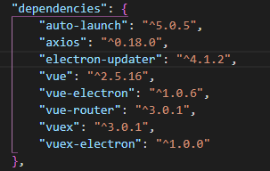

[TOC]

# lesson-6
*create time 2019-07-30*, *update time 2019-08-04*

### 演示了以下功能

- 基于 electron-builder 自动更新 electron应用
- 基于 [auto-launch](https://www.npmjs.com/package/auto-launch) 包，实现应用的开机自启动

> 主要演示electron自动更新，安装的全过程，包含了一个简单的node后台，提供下载，其他后台语言，可自行研究，原理一样

> 基于electron-vue的自动更新的完整示例

目前只测试window平台打包，linux和 macos没测试； macos需要代码签名，签名过后才能发布到mac的应用商店； 签名自行参考其他文章，自动升级可以看下面的源码操作

- electron-vue框架升级（升级的内容只是局部的，具体看下面的）


### 构建步骤

``` bash
# 拉取仓库
git clone xxxx.git

# 切换到electron 安装依赖
cd electron 
yarn

# 切换到 server 运行服务端代码, 我监听的是 3000 端口，如果你的端口冲突，请改为其他端口
cd server
node app.js

# 换electron目录， 运行开发环境，检查有没有问题
npm run dev

# 开发环境没有问题，直接打包，基于window的打包，macos需要签名，我这里没有演示，请查阅相关的文档，加入代码签名
npm run build

```
在build下面，找到最新构建的引用 .exe文件和latest.yml， 将这2个文件拷贝到 server 的 download目录下

在地址栏访问一下 http://你的地址:端口/download/latest.yml  文件， 预期效果是可以直接看到 latest.yml 文件的内容的，如果看不到，请检测服务端是否出现什么问题，看运行node的控制台，查看报错日志

每次有新版本更新，直接修改 package.json中的 version字段，然后 npm run build  构建完成，将构建的文件拷贝到 服务端的download目录下，什么都不需要修改

### 文件夹说明

- server 目录
>   node简单的服务，不依赖任何第三方的包，有node运行环境，直接 npm run app.js 
- electron 目录
>   纯electron升级相关的代码，其实就是 一个 改造过后的 electron-vue 模版


### 针对原版本的 electron-vue 模板升级了以下的包

> 首先，你要明确需要升级的内容，为了避免比较繁琐的升级方式，我采用npm-check 这个包

全局安装
```js
npm install npm-check -g 
```
这个包主要是检测你当前项目的package.json文件中的开发依赖，生产依赖，哪些是需要升级的
安装完成后， 使用如下

```js
// 列举所有需要升级的包
npm-check -u
```
上下移动选择包，空格是选择是不是要升级当前的包，回车表示确认，直接安装你当前所有勾选星号的包

- electron ^5.0.8
- vue ^2.5.16
- electron-builder ^21.1.5
- electron-debug ^3.0.1
- electron-devtools-installer ^2.2.4 这个没啥用，可以不升级

### 注意事项

- 不要升级 webpack相关的东西
- 不要升级 less/sass  等一些loader 升级了 需要修改webpack中的内容，可能存在无休无止的error，warning
- 升级后，electron中不兼容的语法，稍微修改一下，下面的 **升级指南** 中有详细列举，其实修改的地方就2~3处，熟悉electron的，一眼就看出来了
- 服务端提供的自动更新地址，请在浏览器中可以直接访问，并打开该目录下的文件，才行，这是很重要的
- 自启动的API比较简单，如果出现自启动相关的报错，多数是杀毒软件导致，请点击 同意 自启动即可
- auto-launch 一定，一定，一定 要安装到 生产环境依赖，你的app打包后，是生产环境，肯定要将用到的包也一起打包到 生产环境  **npm install --save auto-launch**


### 可能会遇到以下情况

- 打包时，控制台报红，如果说xxx依赖不存在，请安装；如果说是主进程报错，请直接查看对应位置修改； 如果提示源码包报错，直接删除node_modules，重新使用 npm 或者yarn 安装依赖
- 启动应用，并不调用升级的链接，就不进后台接口， 请检测electron 是不是 2.0.x版本，如果是，直接单独升级electron包，推荐使用 npm-check 进行升级管理 [升级指南](https://note.youdao.com/ynoteshare1/index.html?id=8d1aacab7bdac9d4c77a1aabeca1e74b&type=note)
- 打包后，启动软件，提示 electron-updater 包丢失，在安装 auto-launch 的时候，好像被干掉了，重新装一下 electron-updater包到生产依赖即可，然后重新 打包，就ok了


### package.json 依赖包

> 构建过程中出什么问题了，再对比一下下面的图

**生产环境截图**



**开发环境依赖包**

```js
"devDependencies": {
    "ajv": "^6.5.0",
    "babel-core": "^6.26.3",
    "babel-loader": "^7.1.4",
    "babel-plugin-transform-runtime": "^6.23.0",
    "babel-preset-env": "^1.7.0",
    "babel-preset-stage-0": "^6.24.1",
    "babel-register": "^6.26.0",
    "babili-webpack-plugin": "^0.1.2",
    "cfonts": "^2.1.2",
    "chalk": "^2.4.1",
    "copy-webpack-plugin": "^4.5.1",
    "cross-env": "^5.1.6",
    "css-loader": "^0.28.11",
    "del": "^3.0.0",
    "devtron": "^1.4.0",
    "electron": "^5.0.8",
    "electron-builder": "^21.1.5",
    "electron-debug": "^3.0.1",
    "electron-devtools-installer": "^2.2.4",
    "file-loader": "^1.1.11",
    "html-webpack-plugin": "^3.2.0",
    "mini-css-extract-plugin": "0.4.0",
    "multispinner": "^0.2.1",
    "node-loader": "^0.6.0",
    "node-sass": "^4.9.2",
    "sass-loader": "^7.0.3",
    "style-loader": "^0.21.0",
    "url-loader": "^1.0.1",
    "vue-html-loader": "^1.2.4",
    "vue-loader": "^15.2.4",
    "vue-style-loader": "^4.1.0",
    "vue-template-compiler": "^2.5.16",
    "webpack": "^4.15.1",
    "webpack-cli": "^3.0.8",
    "webpack-dev-server": "^3.1.4",
    "webpack-hot-middleware": "^2.22.2",
    "webpack-merge": "^4.1.3"
}
```

**scripts脚本**

>   其实都是electron-vue模板自带了，可以不用看

```js
"scripts": {
    "build": "node .electron-vue/build.js && electron-builder",
    "build:dir": "node .electron-vue/build.js && electron-builder --dir",
    "build:clean": "cross-env BUILD_TARGET=clean node .electron-vue/build.js",
    "build:web": "cross-env BUILD_TARGET=web node .electron-vue/build.js",
    "dev": "node .electron-vue/dev-runner.js",
    "pack": "npm run pack:main && npm run pack:renderer",
    "pack:main": "cross-env NODE_ENV=production webpack --progress --colors --config .electron-vue/webpack.main.config.js",
    "pack:renderer": "cross-env NODE_ENV=production webpack --progress --colors --config .electron-vue/webpack.renderer.config.js",
    "postinstall": ""
},
```


